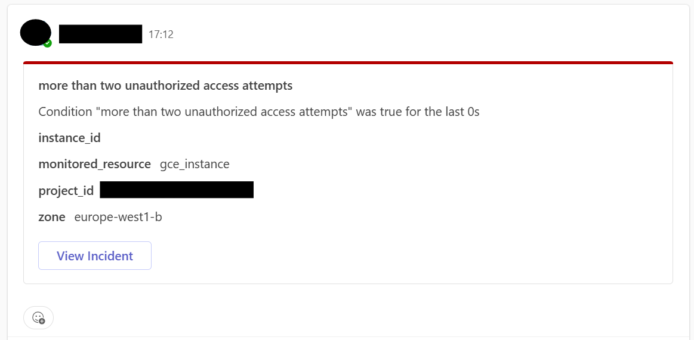

# terraform-gcp-teams-notification-channel

This repository hosts a terraform module to create a notification channel that routes messages to a MS Teams webhook. The message will contain:
- the name of the Alerting Policy
- the condition that triggered the alert
- information about the resource that triggered the alert
- a button to view the incident page in Google Cloud Console

## Usage Example

**Note:** It is recommended that you host the container image in your own private registry.

```hcl
module "teams-notifications" {
  source = "git@github.com:lemigu/terraform-gcp-teams-notification-channel.git//module?ref=v1.0.0"

  webhook_url     = "https://<xxx>.webhook.office.com/webhookb2/<YYYYYYYYYYYYYYYY>"
  project_id      = <you_gcp_project_id>
  container_image = docker.io/dockerlemigu/terraform-gcp-teams-notification-channel:1.0.0
}

resource "google_monitoring_alert_policy" "<your_alerting_policy" {
  
  ...

  notification_channels = [
    module.teams-notifications.channel_id
  ]
}
```



